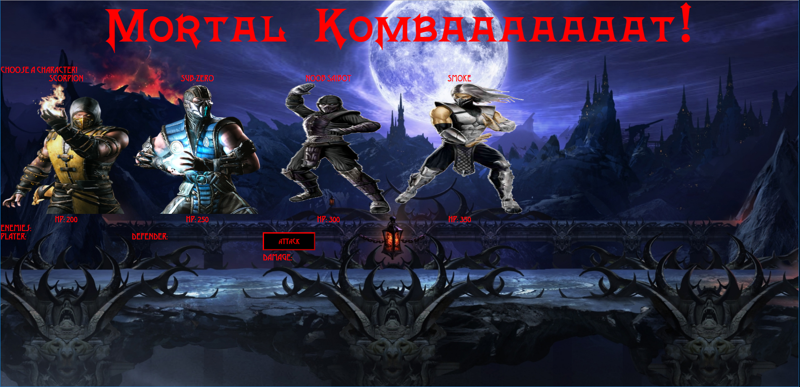

# unit-4-game

[Link to website](https://darryljltolentino.github.io/unit-4-game/)

## Description
This is a website that features a RPG game that requires the user to click on a character they want to be. The other characters become enemies that the user has to fight. The user can now click on an enemy to fight one on one with the character they chose previously. The user can then press the attack button and see how much damage they do to the defending enemy as well as how much damage that enemy does to them. After defeating that enemy, the player can then choose another enemy to fight. The player wins after all the enemies are defeated. If the player takes too much damage, the player loses and has to restart the page to try again.

As soon as the character is chosen, an audio clip of the Mortal Kombat theme song will start playing. If the player defeats a defending enemy, an audio clip of the Mortal Kombat "Fatality" sound bite will play. If the player is defeated, an audio clip of Shao Khan laughing is played. All the logic was coded using jQuery and JavaScript, while styling and layout of the game was coded in HTML and CSS.

| Technology Used | Reference |
| --------------- | --------- |
| HTML | https://developer.mozilla.org/en-US/docs/Web/HTML |
| CSS | https://developer.mozilla.org/en-US/docs/Web/CSS |
| JavaScript | https://www.javascript.com/ |
| jQuery | https://jquery.com/ |

######
| Versioning | Reference |
| ---------- | --------- |
| Github | https://github.com/ |

## Author
- Darryl Tolentino

## Acknowledgement
- Jake Dudum: For bouncing ideas while coding the game